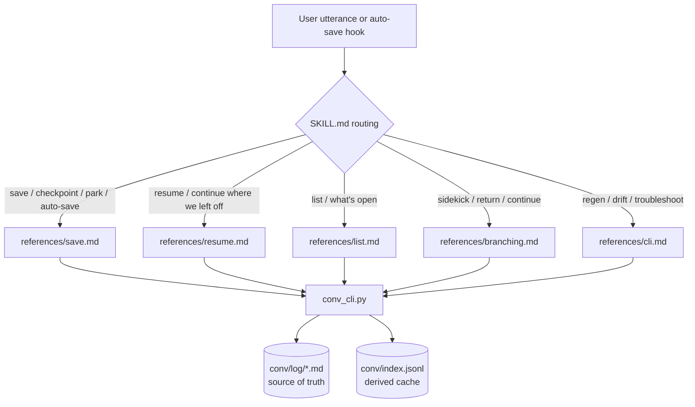
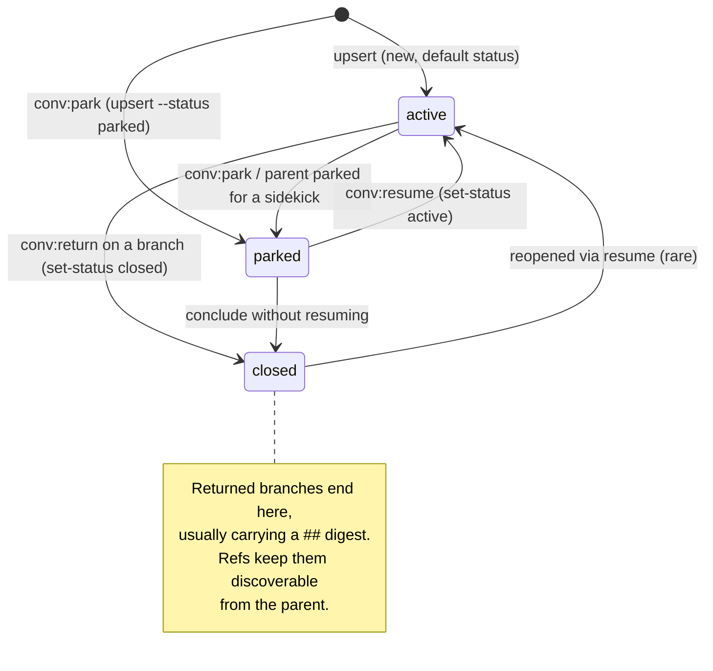
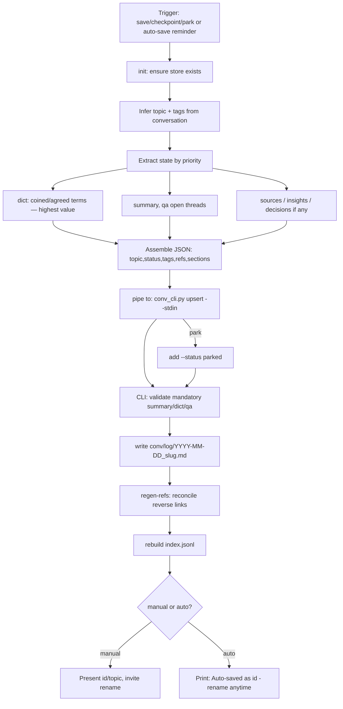
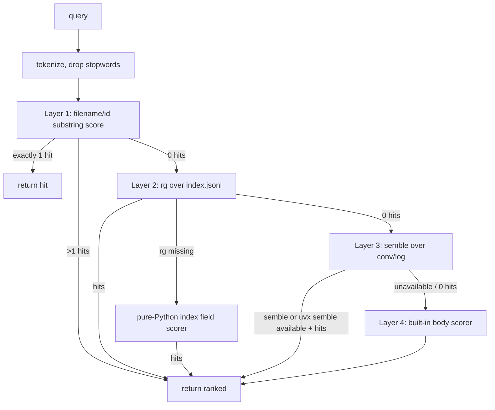
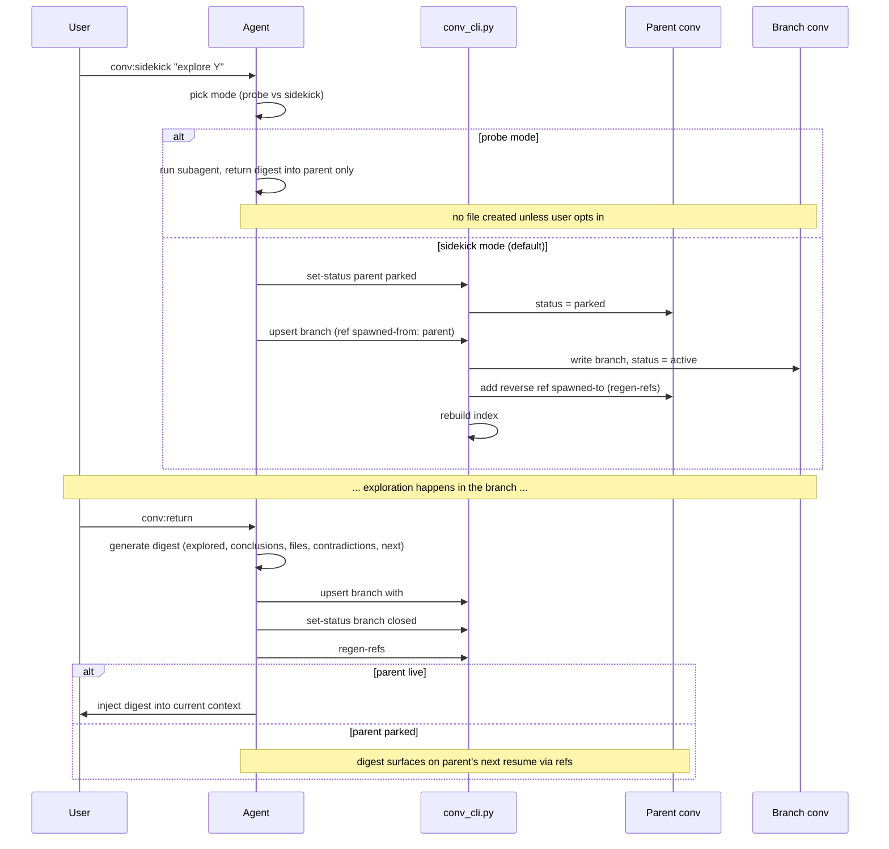
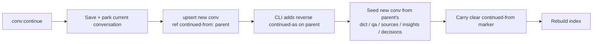
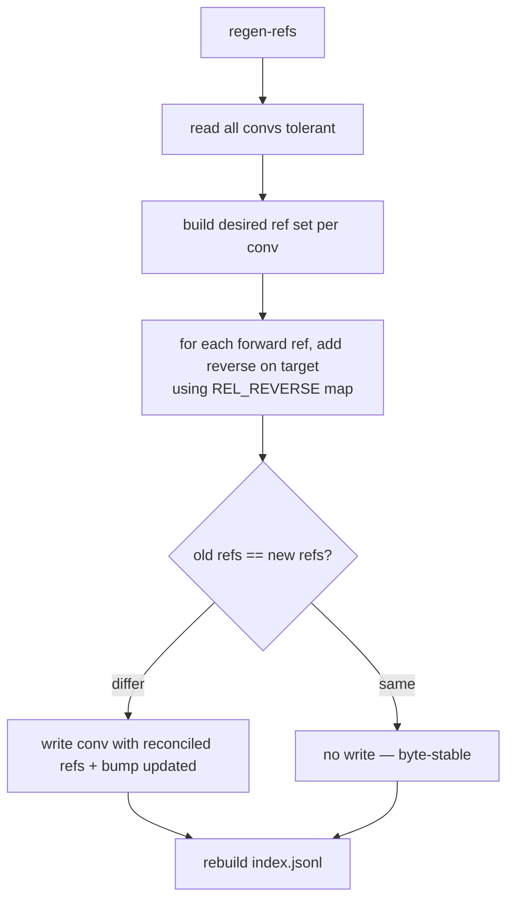
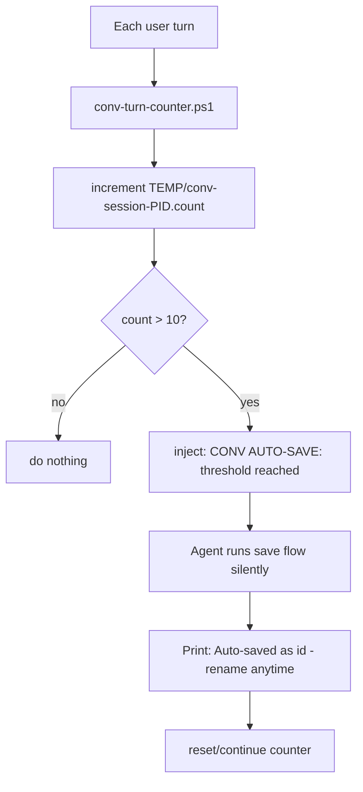
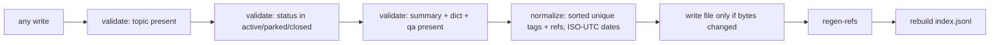

# conversate — Flows & State Machines

Workflows and state machines for the conversate (`conv`) skill. The agent decides
*what* and *when*; the CLI (`conv_cli.py`) performs every store mutation.

## 0. High-level dispatch

How a user utterance becomes work. `SKILL.md` routes intent to a reference playbook,
which drives one or more CLI commands.



## 1. Conversation status state machine

Every conversation is `active`, `parked`, or `closed`. Transitions happen through
`upsert` (initial status) and `set-status`.



## 2. Save / checkpoint flow (`conv:save`, `conv:park`)



Key rule: `summary`, `dict`, and `qa` are mandatory; the CLI rejects a body missing
any of them. Extraction is written for a *cold* agent, excluding tool noise and chatter.

## 3. Resume flow (`conv:resume`)

```mermaid
flowchart TD
    A[User: resume the X discussion] --> B[conv_cli.py search "query"]
    B --> C{how many confident hits?}
    C -->|exactly one| D[show id --markdown]
    C -->|multiple| E[Present ranked ids/topics] --> F[User chooses] --> D
    C -->|none| G[Report nothing found / broaden query]
    D --> H[Reconstruct in order]
    H --> H1[1. frontmatter: id/status/tags/refs]
    H1 --> H2[2. summary]
    H2 --> H3[3. dict — ubiquitous language FIRST]
    H3 --> H4[4. qa — spine; Q open = live threads]
    H4 --> H5[5. sources — read only as needed]
    H5 --> H6[6. insights]
    H6 --> H7[7. decisions — do not relitigate]
    H7 --> H8[8. linked convs via refs]
    H8 --> I[set-status id active]
    I --> J[Present short summary + open threads]
```

## 4. Search cascade (inside `conv_cli.py search`)

The cascade short-circuits at the first layer with a confident result. A single hit at
any layer returns immediately.



| layer label | engine | over what |
|-------------|--------|-----------|
| `fff` | substring score | id + file path |
| `rg-index` / `rg-index-fallback` | `rg` or Python | `index.jsonl` fields |
| `semble` | `semble` / `uvx semble` | `conv/log` bodies (semantic) |
| `semble-body-fallback` | built-in | conversation bodies |

## 5. Branching — sidekick / return (`conv:sidekick`, `conv:return`)

A protected side exploration that does not pollute the parent. The parent is parked,
a peer is spawned, and on return a digest flows back.



## 6. Continue in a clean session (`conv:continue`)

Same topic, fresh session — distinct from a sidekick (which is a side exploration).



## 7. Bidirectional ref reconciliation (`regen-refs`, also run inside `upsert`)

The store is a graph; the CLI guarantees every forward ref has its reverse.



Reverse map: `spawned-from↔spawned-to`, `continued-from↔continued-as`,
`informed-by↔informed`.

## 8. Auto-save loop (turn-counter hook)



## 9. Write invariants (cross-cutting, enforced by the CLI)

These hold for *every* mutating command:



- **Source of truth = `conv/log/*.md`.** `index.jsonl` is always rebuildable.
- **Idempotent writes.** Unchanged content is never rewritten (stable timestamps).
- **`## decisions` is effectively append-only** — never mutated unless the user
  explicitly asks; branch contradictions go to `## qa` as `Q (open)`, not into decisions.
